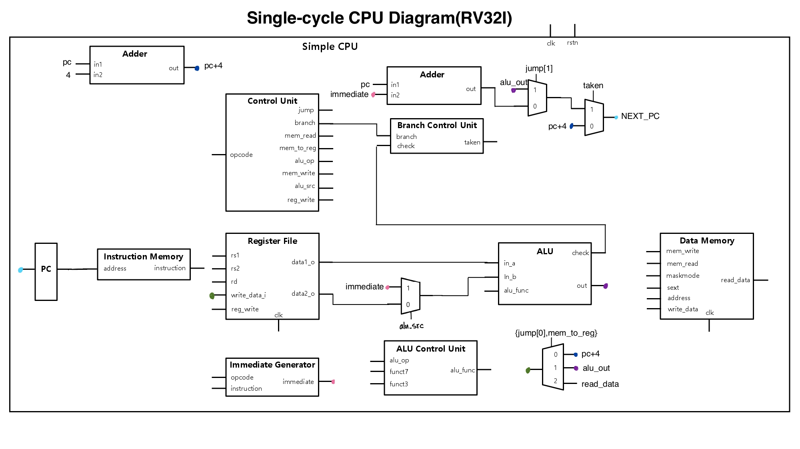

# Single_cycle_CPU_RISC-V


[Single-cycle CPU Diagram]

This is a single-cycle CPU for RV32I base integer instructions written in Verilog HDL. Most of the instructions are implemented except for U-type, ecall, ebreak, etc. I did this project for the Computer Architecture course at SNU.


## How to test the code
```
> make
> python3 test.py
```